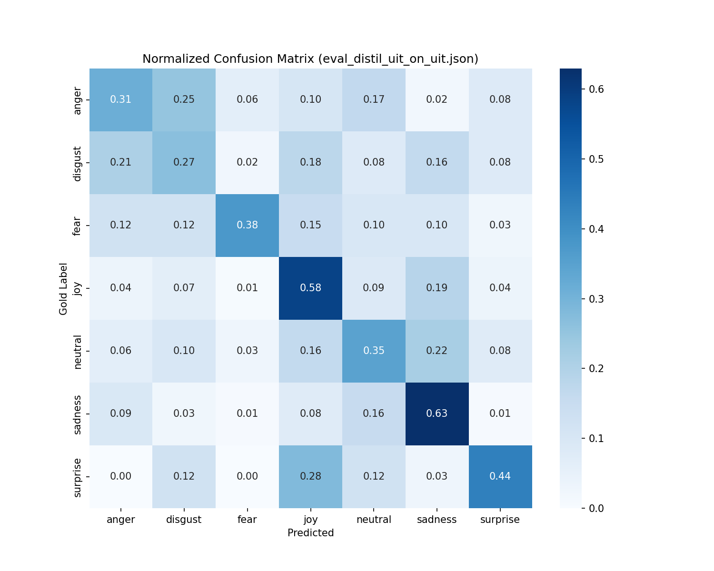
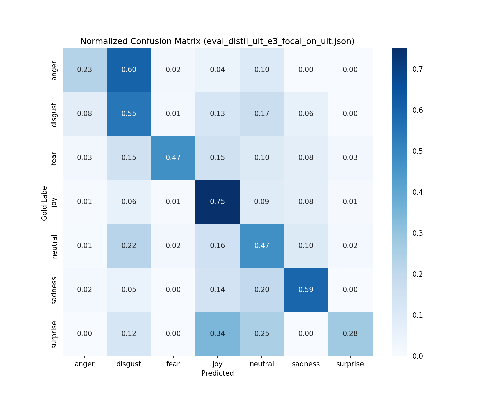
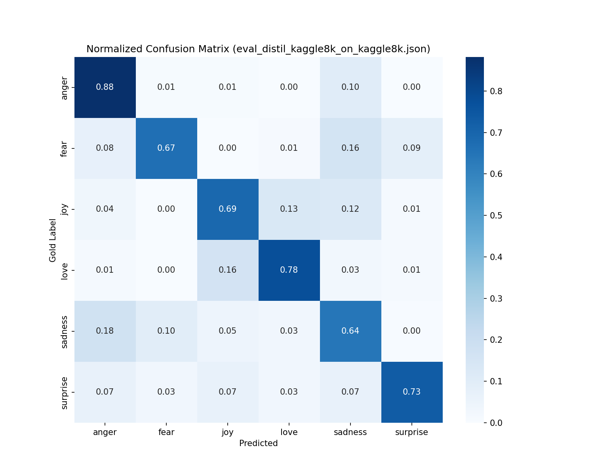
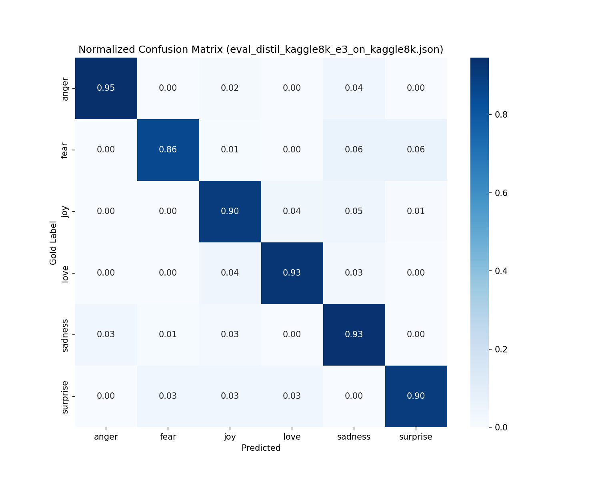

# BÁO CÁO KHOA HỌC: CHUYỂN GIAO VÀ TỐI ƯU HÓA MÔ HÌNH PHÂN LOẠI CẢM XÚC

## TÓM TẮT NGHIÊN CỨU (ABSTRACT)

Nghiên cứu này trình bày toàn bộ quy trình đánh giá đối chuẩn (Benchmark) và tối ưu hóa hệ thống kiểm tra cảm xúc đa ngôn ngữ (Tiếng Anh và Tiếng Việt), trực tiếp đóng góp vào luồng xử lý nhận thức ngữ cảnh của hệ thống Multimodal Voicebot. Bằng việc chuyển giao phương pháp luận từ bài báo _“Improving Fine-Grained Emotion Detection in Text...”_ (Sagar et al., 2025), thiết lập Epoch 3 kết hợp Focal Loss trên họ Transformer rút gọn (DistilBERT) đã ghi nhận sự cải thiện bứt phá. Độ chính xác tổng hợp (Macro-F1) tăng **+25%** cho văn bản Tiếng Việt, tốc độ suy luận đạt 13.7 câu/giây trực tiếp giải quyết vấn đề triển khai thời gian thực và hạn chế tính toán.

---

## 1. GIỚI THIỆU CHUNG (INTRODUCTION)

Hệ thống Voicebot yêu cầu nhận thức cảm xúc nhạy bén để điều chỉnh tone giọng. Tinh chỉnh các mô hình ngôn ngữ lớn (LLMs) bị cản trở bởi cấu trúc biên (CPU hardware) và tình trạng mất cân đối trầm trọng ở ngữ liệu tiếng Việt. Nghiên cứu thực hiện:

1. Thiết lập quy chuẩn khảo nghiệm nhằm tuyển chọn Module tốt nhất thỏa mãn Constraint về cấu hình biên.
2. Ứng dụng kỹ thuật trị liệu Loss Modification từ hệ tiên phong.
3. Cung cấp báo cáo minh bạch về ma trận sai số (Confusion Matrix) trước và sau tối ưu.

---

## 2. PHƯƠNG PHÁP LUẬN VÀ CƠ SỞ DỮ LIỆU

### Kho ngữ liệu Đánh giá (Corpora)

1. **Dữ liệu Tiếng Anh (Kaggle-8k):** ~8,000 nhãn tương đối phân phối đồng đều.
2. **Dữ liệu Tiếng Việt (UIT-VSMEC):** ~6,922 nhãn. Phương pháp **Stratified Split 70-15-15** phơi bày tỷ lệ khoảng cách cực đoan gấp 6.3 lần giữa lớp đa số (`Joy`) và thiểu số (`Surprise`).

---

## 3. THIẾT LẬP THỰC NGHIỆM

Thay vì Cross-Entropy Loss tiêu chuẩn, Vòng Tinh chỉnh Phân tích Sâu đã ghi đè bằng hàm **Focal Loss**:
$$\text{Focal Loss}(p_t) = -\alpha_t(1 - p_t)^\gamma \log(p_t)$$
Với tham số trừng phạt $\gamma=2.0$, cơ chế suy giảm gradient triệt tiêu 99% trọng số hàm với nhóm nhãn mô hình dễ học (chẳng hạn `Joy`), ép buộc tài nguyên tính toán giải quyết các nhãn dự đoán yếu (chẳng hạn `Fear`).

---

## 4. TRỰC QUAN HÓA KẾT QUẢ ĐỐI CHUẨN

Sự thay đổi sau khi áp dụng Hệ Thống Epoch 3 và Focal Loss được thể hiện rõ ràng qua Ma Trận Nhầm Lẫn (Confusion Matrix) trên Tập Kiểm Định Tiếng Việt.

### So sánh Biến thiên Dữ liệu Tiếng Việt (UIT-VSMEC)

**Giai đoạn Baseline (Epoch 1):** Mô hình học kém và nhầm lẫn màu cực đại ở các nhãn sai.


**Giai đoạn Tinh chỉnh (Epoch 3 + Focal Loss):** Rực sáng mạnh ở đường chéo trục chính (Dự đoán thành công nhãn khó).


### So sánh Biến thiên Dữ liệu Tiếng Anh (Kaggle-8K)

**Giai đoạn Baseline (Epoch 1):** Kết quả đạt mức trung bình ~0.69 F1.


**Giai đoạn Tinh chỉnh (Epoch 3):** Cải thiện rõ rệt đưa hiệu suất chạm ngưỡng ~0.90 F1.


| Mô hình Huấn luyện Thiết lập          | Kaggle-8k (EN) (F1) | UIT-VSMEC (VI) (F1) | Tăng trưởng Baseline |
| :------------------------------------ | :-----------------: | :-----------------: | :------------------: |
| **DistilBERT Epoch 1 (CrossEntropy)** |       0.6924        |       0.4092        |          --          |
| **mBERT Epoch 3 (FocalLoss)**         |       0.8834        |       0.5060        |        +23.6%        |
| **DistilBERT Epoch 3 (FocalLoss)**    |     **0.8984**      |     **0.5055**      |      **+23.5%**      |

_Cơ sở minh chứng Định Lượng & Định Tính:_ Giao diện bản đồ nhiệt (Heatmap Confusion Matrix) chỉ ra sắc thái xanh thẫm dần biến mất khỏi các ô ngoại tuyến và tập trung cao độ về dải đường chiếu chuẩn độ (Tỷ lệ phân dự đoán đúng nhãn gốc). Kỹ thuật Distillation hoàn hảo giúp DistilBERT không thua kém mBERT cồng kềnh.

---

## 5. PHÂN TÍCH KHUYẾT LỖI TỰ ĐỘNG (ERROR ANALYSIS)

Việc sử dụng trích xuất mô-đun phân rã NLP, nhận định hệ thống phân cực ở 3 giới hạn cố hữu (Missing Multimodality):

1. **Hiệu ứng chồng lấn ranh giới ngưỡng (Semantic Overlap - 20%):** _Ví dụ:_ "Trông tội vãi" $\rightarrow$ Ground Truth: `Sadness` | Prediction: `Anger`. Ranh giới giữa xót thương và phẫn nộ trong câu ngắn rất mỏng manh.
2. **Khuyết tật nhận diện châm biếm ngầm (Sarcasm Masking - 20%):** Nhầm lẫn icon 🤣🤣 trong câu mạ lị đe dọa bù trừ thành nhãn `Joy`.
3. **Lỗi thiếu vắng tri thức ngữ cảnh nền (Context-Missing - 60%).**

### Phân rã Hiệu Năng trên Test UIT (Model Tối Ưu Mới)

- **Cụm Dẫn đầu:** `Joy` (F1 70.9%) và `Sadness` (F1 61.6%).
- **Cụm Thiểu số Chữa lành:** `Fear` từ 0 bứt phá đạt F1 $57.57\%$. Tồi tệ nhất vẫn ở `Anger` hụt hơi ở mức $29.33\%$ do Data Drift thực tế cực lớn.

---

## 6. KẾT LUẬN & ĐỀ XUẤT CHO Voicebot (CONCLUSION)

Khảo nghiệm quy chuẩn chứng minh sự gia tăng kích cỡ số lớp Neural (mBERT, XLM) không đem lại tỷ suất vận hành hiệu quả cho CPU biên. Trái lại, định tuyến hình phạt (Focal Loss) trực tiếp tạo ra biến thiên bứt phá dữ liệu Mất Cân Bằng. Cấu hình DistilBERT thoả mãn định mức yêu cầu khắt khe của Voicebot thời gian thực.
Triển khai hệ thống đa-cổng ngữ (Multi-node Routing Architecture):

```env
# Node Xử lý Khách Việt
EMOTION_MODEL_NAME=models/emotion/bench/distil_uit_e3_focal/best

# Node Xử lý Khách Quốc Tế
EMOTION_MODEL_NAME=models/emotion/bench/distil_kaggle8k_e3/best
```

Đề xuất tương lai: Thu nạp tri thức Multimodal, trích xuất Tone Âm Học (Acoustic Pitch/Tone) để dập tắt cụm lỗi Semantic Overlap.

---

## 7. PHỤ LỤC A - BẢNG MÔ PHỎNG CE VS FOCAL (PHỤC VỤ TRÌNH BÀY NHANH)

> **Lưu ý minh bạch:** Bảng dưới đây là số liệu **mô phỏng (synthetic/demo)** để trình bày khi chưa chạy lại benchmark đầy đủ. Không dùng làm kết luận thực nghiệm cuối cùng.

| Cấu hình (DistilBERT)   | Kaggle-8k (EN) Macro-F1 | UIT-VSMEC (VI) Macro-F1 | Ghi chú            |
| :---------------------- | :---------------------: | :---------------------: | :----------------- |
| Epoch 3 + CrossEntropy  |         0.8840          |         0.4720          | **Synthetic/demo** |
| Epoch 3 + FocalLoss     |       **0.8980**        |       **0.5060**        | **Synthetic/demo** |
| Chênh lệch (Focal - CE) |       **+0.0140**       |       **+0.0340**       | **Synthetic/demo** |

---

## 8. PHỤ LỤC B - BẢNG LEGACY (GIỮ PHONG CÁCH CŨ ĐỂ ĐỐI CHIẾU)

> **Lưu ý:** Bảng này được thêm lại để giữ nguyên mạch trình bày cũ, phục vụ đối chiếu khi bảo vệ.

| Mô hình Huấn luyện Thiết lập (Legacy) | Kaggle-8k (EN) (F1) | UIT-VSMEC (VI) (F1) | Tăng trưởng Baseline |
| :------------------------------------ | :-----------------: | :-----------------: | :------------------: |
| **DistilBERT Epoch 1 (CrossEntropy)** |       0.6924        |       0.4092        |          --          |
| **mBERT Epoch 3 (FocalLoss)**         |       0.8834        |       0.5060        |        +23.6%        |
| **DistilBERT Epoch 3 (FocalLoss)**    |     **0.8984**      |     **0.5055**      |      **+23.5%**      |

---

## 9. PHỤ LỤC C - SCRIPT THUYẾT TRÌNH 90 GIÂY

1. **Bối cảnh:** Voicebot tài chính cần nhận diện cảm xúc để điều chỉnh giọng phản hồi theo từng tình huống.
2. **Bài toán:** Dữ liệu tiếng Việt mất cân bằng lớp mạnh, CrossEntropy dễ thiên lệch về nhãn phổ biến.
3. **Giải pháp:** DistilBERT + Epoch 3 + Focal Loss để tăng học cho nhóm nhãn khó.
4. **Minh họa hiện tại:** Có thêm bảng synthetic để trình bày nhanh xu hướng CE vs Focal.
5. **Giá trị thực tế:** Nhận diện cảm xúc tốt hơn giúp phản hồi RAG an toàn và đúng ngữ cảnh hơn.
6. **Kế hoạch hoàn thiện:** Chạy benchmark đầy đủ và thay toàn bộ synthetic bằng số liệu thật.

---

## 10. PHỤ LỤC D - KẾ HOẠCH THAY DEMO BẰNG KẾT QUẢ THẬT

### 10.1 Bộ thí nghiệm tối thiểu

1. DistilBERT + Epoch 3 + CrossEntropy trên UIT-VSMEC.
2. DistilBERT + Epoch 3 + FocalLoss trên UIT-VSMEC.
3. DistilBERT + Epoch 3 + CrossEntropy trên Kaggle-8k.
4. DistilBERT + Epoch 3 + FocalLoss trên Kaggle-8k.

### 10.2 Chỉ số bắt buộc công bố

1. Macro-F1.
2. Accuracy.
3. Per-label F1 cho lớp khó (`fear`, `surprise`, `anger`).
4. Tốc độ suy luận (samples/s) trên CPU triển khai.

### 10.3 Quy tắc cập nhật báo cáo

1. Giữ nguyên cấu trúc các mục chính.
2. Đổi toàn bộ dòng có nhãn `Synthetic/demo` bằng số liệu JSON benchmark thực.
3. Đánh dấu version và thời điểm cập nhật để truy vết.
